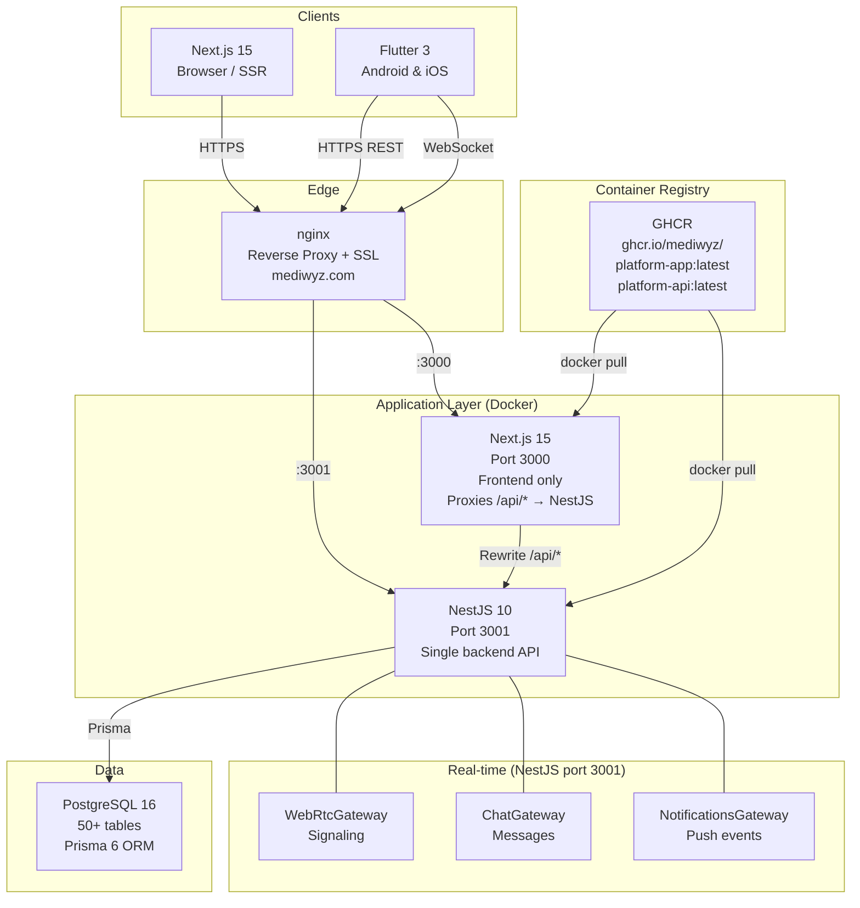
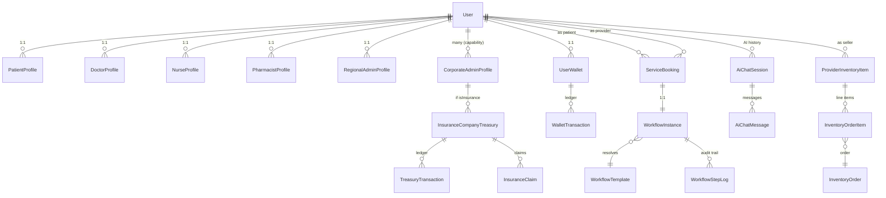
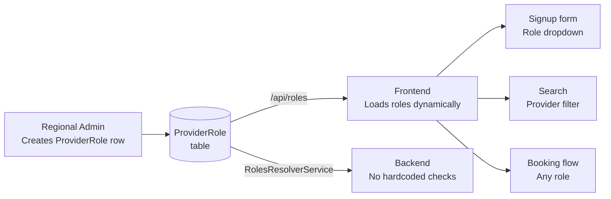
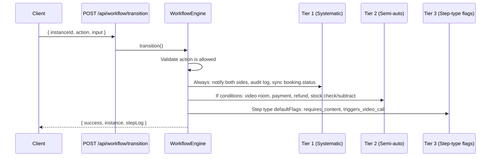
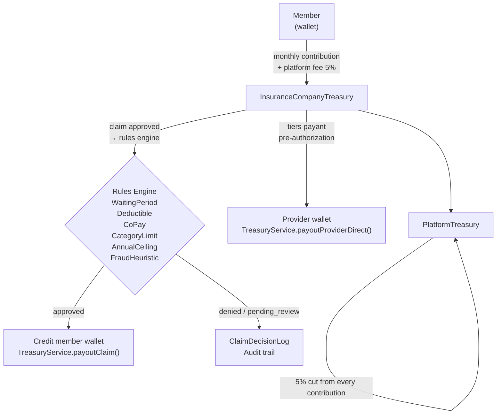
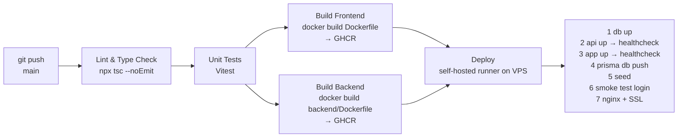

# MediWyz — Digital Health Platform

A multi-country SaaS platform connecting patients with 17+ provider types across Mauritius, Madagascar, Kenya, Togo, Benin, and Rwanda. Built on **Next.js 15** (frontend) + **NestJS 10** (backend) + **Flutter** (mobile), with a configurable workflow engine, real-time video/chat, insurance SaaS, and an AI health assistant.

---

## Table of Contents

- [System Architecture](#system-architecture)
- [Tech Stack](#tech-stack)
- [Repository Structure](#repository-structure)
- [Data Model](#data-model)
- [Dynamic Role System](#dynamic-role-system)
- [Workflow Engine](#workflow-engine)
- [Insurance SaaS & Money Flow](#insurance-saas--money-flow)
- [Real-time (Socket.IO)](#real-time-socketio)
- [AI Assistant](#ai-assistant)
- [CI/CD Pipeline](#cicd-pipeline)
- [Development Setup](#development-setup)
- [Environment Variables](#environment-variables)
- [User Types & Demo Accounts](#user-types--demo-accounts)
- [API Documentation](#api-documentation)

---

## System Architecture



### Key architectural decisions

| Decision | Rationale |
|----------|-----------|
| **NestJS is the ONLY backend** | Next.js is pure frontend. `app/api/` removed. All `/api/*` proxied via `next.config.ts` rewrites |
| **Dynamic roles** | Provider roles (Doctor, Nurse, Optician…) are DB rows in `ProviderRole`, not code enums |
| **Single `ServiceBooking` model** | All booking types converge on one table; legacy tables kept read-only |
| **Workflow engine** | Every status change goes through `WorkflowEngine.transition()` — never direct DB update |
| **Capability over role** | Corporate admin, insurance owner, referral partner = capabilities, not signup roles |

---

## Tech Stack

| Layer | Technology |
|-------|-----------|
| **Web frontend** | Next.js 15.4 (App Router), React 19, TypeScript 5 |
| **Styling** | Tailwind CSS 4, Framer Motion |
| **State** | Zustand, React hooks |
| **Mobile** | Flutter 3.x (Android + iOS + Web) |
| **Backend API** | NestJS 10 (TypeScript), class-validator, Passport |
| **Real-time** | Socket.IO 4.8 (3 gateways on NestJS) |
| **Video** | WebRTC via simple-peer (P2P, signaled through NestJS) |
| **Database** | PostgreSQL 16 + Prisma 6 ORM |
| **Auth** | JWT (httpOnly cookies), bcrypt, global JwtAuthGuard |
| **AI** | Groq API (llama-3.1-8b-instant / llama-3.2-11b-vision) |
| **Payments** | Internal Health Credit ledger (MCB Juice seam ready) |
| **Container** | Docker, Docker Compose, GHCR |
| **CI/CD** | GitHub Actions → GHCR → self-hosted runner on VPS |
| **Reverse proxy** | nginx + Let's Encrypt (Certbot) |
| **Scheduler** | `@nestjs/schedule` — reminder sweeps every 30 min |

---

## Repository Structure

```
platform/
├── app/                          # Next.js App Router (frontend only)
│   ├── [userType]/(dashboard)/   # Dashboard per user type — no /dashboard/ in URL
│   │   ├── layout.tsx            # DashboardLayout wrapper
│   │   ├── sidebar-config.ts     # Sidebar items driven by userType
│   │   └── page.tsx              # Overview page
│   ├── search/
│   │   ├── health-shop/          # Health Shop — browse all providers' inventory
│   │   └── providers/            # Provider search by role
│   ├── login/                    # Login page
│   ├── signup/                   # Registration
│   └── page.tsx                  # Landing page (CMS-driven)
│
├── backend/                      # NestJS backend (port 3001)
│   └── src/
│       ├── auth/                 # JWT, guards, registration, login
│       ├── bookings/             # Universal booking via ServiceBooking
│       ├── workflow/             # Workflow engine: engine, strategies, registry
│       ├── search/               # Provider + health shop search
│       ├── ai/                   # Groq AI assistant + health tracker
│       ├── corporate/            # Corporate plans, insurance SaaS, treasury
│       ├── payments/             # MCB Juice seam (mock|mcb_juice toggle)
│       ├── notifications/        # Push + Socket.IO notifications
│       ├── shared/               # Guards, interceptors, filters, pipes
│       └── main.ts               # Bootstrap: CORS, global guards, Swagger
│
├── components/
│   ├── dashboard/                # DashboardLayout, Sidebar, Header
│   ├── settings/                 # SettingsLayout + shared tabs
│   ├── shared/                   # DashboardStatCard, PaymentMethodForm, PageHeader
│   ├── video/                    # VideoConsultation (shared, any user type)
│   ├── workflow/                 # WorkflowTimeline, WorkflowCurrentStep, Builder
│   └── health-shop/              # ShopItemCard, ShopFilters, CartContext, FloatingCart
│
├── hooks/                        # useAuth, useSocket, useWebRTC, useCurrency
│
├── lib/
│   ├── auth/                     # JWT helpers, cookie helpers, Zod schemas
│   ├── db.ts                     # Prisma client singleton (default export)
│   ├── workflow/                 # Workflow engine (frontend-side types + helpers)
│   └── commission.ts             # Commission calculation (Platform 15% / Provider 85%)
│
├── mobile/                       # Flutter app (Android + iOS)
│   ├── lib/
│   │   ├── api/                  # Dio-based HTTP wrappers per module
│   │   ├── models/               # Freezed data classes
│   │   ├── screens/              # One screen per route
│   │   ├── widgets/              # Reusable components
│   │   ├── services/             # Auth, socket, Riverpod notifiers
│   │   ├── router/               # go_router routes + auth redirect
│   │   └── theme/                # MediWyzColors, ThemeData
│   └── test/                     # flutter_test unit + widget tests
│
├── prisma/
│   ├── schema.prisma             # 50+ tables, normalized
│   └── seeds/                    # 57 modular seed files (00-regions → 50-health-shop)
│
├── nginx/                        # nginx config + SSL setup script
├── scripts/                      # setup-nginx.sh, deploy helpers
├── .github/
│   ├── workflows/
│   │   └── deploy.yml            # Build → GHCR → SSH deploy to VPS
│   ├── CODEOWNERS                # Auto-request reviews by path
│   └── dependabot.yml            # Weekly grouped dependency updates
└── docker-compose.yml            # db + api (NestJS) + app (Next.js)
```

---

## Data Model



### Core tables

| Model | Purpose |
|-------|---------|
| `User` | Single auth table for all 17 user types + roles |
| `PatientProfile` / `DoctorProfile` / … | 1:1 type-specific profile (16 profile tables) |
| `ServiceBooking` | Universal booking model (all provider types) |
| `WorkflowTemplate` | N-step booking script per (providerType × serviceMode) |
| `WorkflowInstance` | Live state for one booking |
| `ProviderRole` | Dynamic role definitions — created by Regional Admins |
| `RoleFeatureConfig` | Per-role feature flags |
| `PlatformService` | Bookable service catalog |
| `ProviderInventoryItem` | Health Shop inventory (any provider) |
| `UserWallet` + `WalletTransaction` | Internal Health Credit ledger |
| `InsuranceCompanyTreasury` | Pooled insurance premium pool |

---

## Dynamic Role System

Provider roles are **not code enums** — they are rows in `ProviderRole` created by Regional Admins.



- Zero code changes needed when a new role is added
- `MEMBER` and `REGIONAL_ADMIN` are the only two system-defined types
- Corporate admin, insurance owner, referral partner are **capabilities** (DB-driven), not roles
- Every user has patient/member capabilities by default

---

## Workflow Engine

All booking status changes go through `WorkflowEngine.transition()`. Three-tier trigger system:



Template resolution order (most specific wins):

1. Provider's custom template linked to exact `platformServiceId`
2. Regional admin template for same service + region
3. System default for exact service
4. Regional admin generic template for (providerType + serviceMode + region)
5. System default for (providerType + serviceMode)
6. Provider's generic fallback

---

## Insurance SaaS & Money Flow



| Flow | From → To | Service |
|------|-----------|---------|
| Booking | Member wallet → Provider wallet (85%) + Platform (15%) | `BookingsService` |
| Insurance contribution | Member wallet → Treasury (95%) + Platform (5%) | `TreasuryService` |
| Claim approval | Treasury → Member wallet | `TreasuryService.payoutClaim()` |
| Tiers payant | Treasury → Provider wallet | `TreasuryService.payoutProviderDirect()` |

Payment gateway toggle: `PAYMENT_GATEWAY=mock|mcb_juice` (MCB Juice seam in `backend/src/payments/`).

---

## Real-time (Socket.IO)

Three gateways on NestJS port 3001:

| Gateway | Namespace | Key events |
|---------|-----------|-----------|
| `WebRtcGateway` | `/` | `join-room`, `signal`, `user-joined`, `heartbeat` |
| `ChatGateway` | `/` | `chat:message:send`, `chat:message:new`, `chat:typing` |
| `NotificationsGateway` | `/` | `notification:new`, `notification:read` |

Room naming: `user:{userId}` · `convo:{id}` · `room:{roomCode}`

Frontend connects via `NEXT_PUBLIC_SOCKET_URL` (default `http://localhost:3001`). One connection per app, initialized in `DashboardLayout`.

---

## AI Assistant

Groq-backed assistant with healthcare safety rules:

- **Context**: assembled from `AiService.getUserContext(userId)` — reads User + HealthTrackerProfile + PatientProfile + DoctorProfile. Single query, never piecemeal.
- **Models**: `llama-3.1-8b-instant` (chat) · `llama-3.2-11b-vision-preview` (food/receipt OCR)
- **Safety**: dangerous keywords → skip LLM, return emergency services immediately. Allergy hard-constraints enforced as post-filter. Never diagnose.
- **Endpoints**: `GET /api/ai/chat` · `POST /api/ai/chat` · `GET /api/ai/chat/:id` · `DELETE /api/ai/chat/:id`

---

## CI/CD Pipeline



- Images pushed to `ghcr.io/mediwyz/platform-app:latest` and `platform-api:latest`
- Self-hosted runner on Hostinger VPS (`runs-on: [self-hosted, mediwyz]`)
- Environment: `production` (locked to `main` branch only)
- CODEOWNERS: `.github/`, `prisma/`, `backend/src/auth/`, `backend/src/payments/` → `@Mediwyz/devops`

---

## Development Setup

### Prerequisites

- Node.js 20+
- Docker + Docker Compose
- PostgreSQL 16 (or use Docker)
- Flutter 3.x (for mobile)

### Local (without Docker)

```bash
# 1. Install dependencies
npm install
cd backend && npm install && cd ..

# 2. Configure environment
cp .env.example .env
# Edit DATABASE_URL, JWT_SECRET, GROQ_API_KEY

# 3. Database
npx prisma db push          # Create/sync tables
npx prisma db seed          # Seed 57 demo files

# 4. Start both servers
cd backend && npm run start:dev   # NestJS on :3001
npm run dev                        # Next.js on :3000

# Swagger UI: http://localhost:3001/api/docs
# App: http://localhost:3000
```

### Local (Docker Compose)

```bash
docker compose up --build -d
# App: http://localhost:3000
# API: http://localhost:3001
```

### Mobile (Flutter)

```bash
cd mobile
flutter pub get
flutter run -d chrome           # Web (for rapid dev)
flutter run -d android          # Android device/emulator
flutter run -d ios              # iOS simulator
flutter build apk               # Android release
flutter build ios               # iOS release (macOS required)
```

### Useful commands

```bash
# Type check
npx tsc --noEmit                   # Frontend
cd backend && npx tsc --noEmit    # Backend

# Tests
npm run test                       # Vitest unit tests
cd backend && npx jest             # NestJS unit tests
npx playwright test                # E2E suite

# Database
npx prisma studio                  # Visual DB browser
npx prisma migrate dev             # Create migration
```

---

## Environment Variables

| Variable | Description | Required |
|----------|-------------|----------|
| `DATABASE_URL` | PostgreSQL connection string | ✅ |
| `JWT_SECRET` | JWT signing key | ✅ |
| `GROQ_API_KEY` | Groq AI API key | ✅ |
| `POSTGRES_PASSWORD` | PostgreSQL password (Docker) | ✅ |
| `NEXT_PUBLIC_APP_URL` | Public app URL | ✅ |
| `NEXT_PUBLIC_SOCKET_URL` | NestJS Socket.IO URL | ✅ |
| `NEXT_PUBLIC_API_URL` | NestJS API URL | ✅ |
| `API_INTERNAL_URL` | Internal NestJS URL (Docker: `http://api:3001`) | ✅ |
| `APP_DOMAIN` | Custom domain (e.g. `mediwyz.com`) | Production |
| `CORS_ALLOWED_ORIGINS` | Allowed origins for CORS | Production |
| `SUPER_ADMIN_EMAIL` | Auto-created super admin email | ✅ |
| `SUPER_ADMIN_PASSWORD` | Auto-created super admin password | ✅ |
| `PAYMENT_GATEWAY` | `mock` or `mcb_juice` | Default: `mock` |
| `NODE_ENV` | `development` or `production` | ✅ |

---

## User Types & Demo Accounts

| User Type | URL Prefix | Demo Email | Password |
|-----------|-----------|-----------|----------|
| Member (Patient) | `/patient/` | `emma.johnson@mediwyz.com` | `Patient123!` |
| Doctor | `/doctor/` | `dr.amara.diallo@mediwyz.com` | `Doctor123!` |
| Nurse | `/nurse/` | `nurse.claire@mediwyz.com` | `Nurse123!` |
| Nanny | `/nanny/` | `nanny.sophie@mediwyz.com` | `Nanny123!` |
| Pharmacist | `/pharmacist/` | `pharma.jean@mediwyz.com` | `Pharma123!` |
| Lab Technician | `/lab-technician/` | `lab.marie@mediwyz.com` | `Lab123!` |
| Emergency Worker | `/responder/` | `emt.david@mediwyz.com` | `EMT123!` |
| Insurance Rep | `/insurance/` | `insurance.rep@mediwyz.com` | `Insurance123!` |
| Corporate Admin | `/corporate/` | `corporate.admin@mediwyz.com` | `Corporate123!` |
| Regional Admin (MU) | `/regional/` | `regional.mu@mediwyz.com` | `Regional123!` |
| Caregiver | `/caregiver/` | `caregiver.alice@mediwyz.com` | `Caregiver123!` |
| Physiotherapist | `/physiotherapist/` | `physio.paul@mediwyz.com` | `Physio123!` |
| Dentist | `/dentist/` | `dentist.sara@mediwyz.com` | `Dentist123!` |
| Optometrist | `/optometrist/` | `optometrist.lisa@mediwyz.com` | `Optometrist123!` |
| Nutritionist | `/nutritionist/` | `nutritionist.marc@mediwyz.com` | `Nutritionist123!` |
| Super Admin | `/admin/` | set via env `SUPER_ADMIN_EMAIL` | env `SUPER_ADMIN_PASSWORD` |

---

## API Documentation

Interactive Swagger UI available at **http://localhost:3001/api/docs** when running locally.

### Key endpoint groups

| Group | Base path | Description |
|-------|-----------|-------------|
| Auth | `/api/auth/*` | Login, register, logout, me |
| Bookings | `/api/bookings` | Universal booking (all provider types) |
| Workflow | `/api/workflow/*` | Transitions, templates, instances |
| Search | `/api/search/*` | Providers + Health Shop |
| AI | `/api/ai/*` | Chat sessions, health tracker |
| Corporate | `/api/corporate/*` | Plans, insurance, treasury, claims |
| Roles | `/api/roles` | Dynamic provider roles from DB |
| Users | `/api/users/:id/*` | Profile, wallet, notifications, subscriptions |
| Inventory | `/api/inventory/*` | Health Shop items + orders |
| Regional | `/api/regional/*` | Plans, workflow templates, service groups |

---

## Contributing

1. All provider-role branching is **forbidden** in new code — use `ProviderRole` from `/api/roles`
2. All booking status changes go through `WorkflowEngine.transition()` — never direct DB update
3. Money movements must write a `WalletTransaction` / `TreasuryTransaction` inside `prisma.$transaction()`
4. New features need: DTO, service method, unit test, empty state, error state
5. Web changes visible on mobile must have a Flutter mirror in the same PR
6. Run `npx tsc --noEmit && cd backend && npx tsc --noEmit` before pushing

All commits are authored by the developer. See `CLAUDE.md` for full project conventions.
